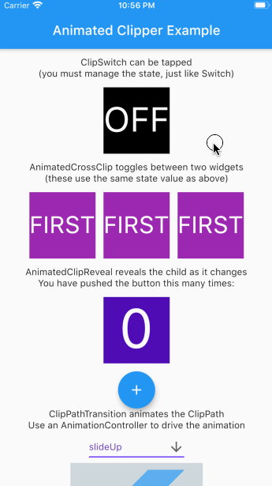
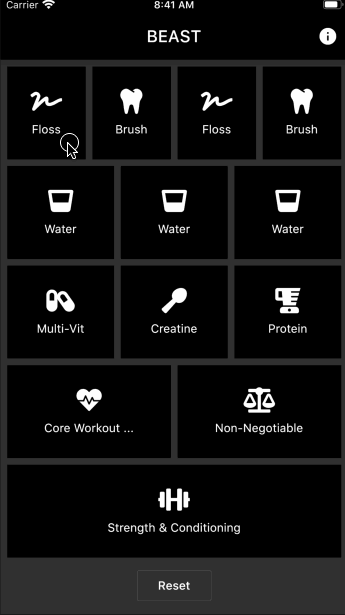

# animated_clipper

Clip your widgets with Animated Clippers.

Reveal widgets with `AnimatedClipReveal`.

Animate between two widgets with `AnimatedCrossClip`.

Interactively switch between two widgets with `ClipSwitch`.

Use `ClipPathTransition` if you want to use an `AnimationController`.

A collection of `PathBuilders` are bundled for rendering (see below)

### Example

The example project demonstrates the main widgets

### Live Demo

The BEAST app uses `animated_clipper` for its "todo" screen

### PathBuilders

There are a number of `PathBuilder` classes inclded. Or you can roll your own.

Demo | PathBuilder
------------ | -------------
 | PathBuilders.slideUp
 | PathBuilders.slideDown
 | PathBuilders.slideLeft
 | PathBuilders.slideRight
 | PathBuilders.splitVerticalIn
 | PathBuilders.splitVerticalOut
 | PathBuilders.splitHorizontalIn
 | PathBuilders.splitHorizontalOut
 | PathBuilders.circleIn
 | PathBuilders.circleOut
